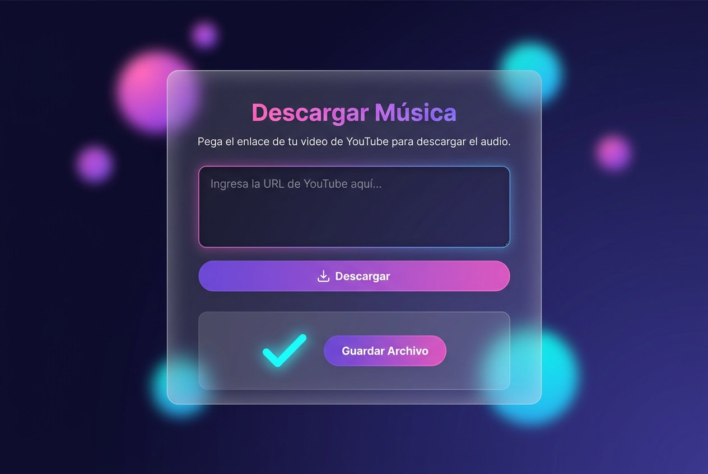

<div align="center">

# 🎵 YT Music Downloader

**Descarga música de YouTube como MP3 directamente desde tu navegador.**  
Soporta videos individuales, playlists completas y múltiples URLs a la vez.


</div>

---

## ✨ Características

- 🎵 **Descarga como MP3** (192 kbps) o en formato original
- 📋 **Múltiples URLs** — pega varias a la vez, una por línea
- 📂 **Playlists completas** — descarga listas enteras de YouTube
- 🖼️ **Metadatos automáticos** — portada e información del artista embebidos
- 📦 **ZIP automático** — si descargas más de un archivo, los recibe en un `.zip`
- 🌐 **Interfaz web** — no necesitas usar la terminal para descargar

## 📸 Vista previa

> La interfaz usa glassmorphism con un diseño oscuro y moderno.



---

## 🚀 Instalación rápida

### Requisitos previos

Antes de empezar, asegúrate de tener instalado:

| Herramienta | Versión mínima | Descarga |
|---|---|---|
| **Python** | 3.8+ | [python.org](https://www.python.org/downloads/) |
| **FFmpeg** | Cualquier versión reciente | [ffmpeg.org](https://ffmpeg.org/download.html) |

> ⚠️ **FFmpeg es obligatorio** para convertir a MP3. Después de descargarlo, agrégalo al PATH del sistema.

### Instalación

```bash
# 1. Clona el repositorio
git clone https://github.com/M4nuelBurgos/Music.git
cd Music

# 2. Crea un entorno virtual (recomendado)
python -m venv venv

# 3. Actívalo
# Windows:
venv\Scripts\activate
# macOS/Linux:
source venv/bin/activate

# 4. Instala las dependencias
pip install -r requirements.txt
```

### Verificar FFmpeg

Abre una terminal y ejecuta:
```bash
ffmpeg -version
```
Si ves la versión, está correctamente instalado.

---

## ▶️ Uso

```bash
python app.py
```

Luego abre tu navegador en: **[http://localhost:5000](http://localhost:5000)**

1. Pega uno o varios enlaces de YouTube (uno por línea)
2. Marca/desmarca "Convertir a MP3" según prefieras
3. Haz clic en **Descargar**
4. Espera y guarda tu archivo

---

## 📁 Estructura del proyecto

```
yt-music-downloader/
├── app.py                  # Servidor Flask principal
├── requirements.txt        # Dependencias Python
├── models/
│   └── downloader.py       # Lógica de descarga con yt-dlp
├── templates/
│   └── index.html          # Interfaz web (HTML)
├── static/
│   ├── css/style.css       # Estilos (glassmorphism)
│   └── js/main.js          # Lógica del frontend
└── downloads/              # Carpeta donde se guardan los archivos (no en Git)
```

---

## 🔧 Configuración

Por defecto el servidor corre en el puerto `5000`. Para cambiarlo, edita la última línea de `app.py`:

```python
app.run(debug=True, port=5000)  # Cambia 5000 por el puerto que prefieras
```

Para usarlo en modo producción, cambia `debug=True` a `debug=False`.

---

## ⚖️ Aviso legal

Este proyecto es solo para uso **educativo y personal**. Descarga únicamente contenido del cual tengas los derechos o que esté bajo licencias que lo permitan. El uso indebido es responsabilidad del usuario.

---

## 📄 Licencia

Distribuido bajo la licencia **MIT**. Ver el archivo [LICENSE](LICENSE) para más detalles.

---

<div align="center">
Hecho con ❤️ y Python
</div>
